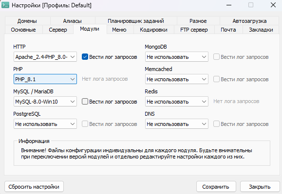

**Создание API на Laravel для управления электронными кошельками**

**Текст ТЗ**

Требуется реализовать API интерфейс для работы с балансом пользователя.
Необходимо реализовать методы:
1. Авторизация
2. Регистрация
3. Получение баланса
4. Получение истории переводов
5. Перевод средств от одного пользователя другому

Пожелания (не обязательно, но очень желательно):
1. Контейнеризировать сервис
2. Создать коллекцию postman (либо написать спецификацию в OpenAPI)
3. Написать тесты (unit, integration)

**Что сделал**

Выполнил все по основным моментам, проверял все действия через Postman. Импортировал в версии 2.1. Базу данных тоже приложу в корне проекта

**Что не сделал**

Не контенизировал приложение, могу связать это с тем, что работаю на нескольких устройствах идентичных по OS и используемому софту.

Не написал тесты, проверял через Postman и ручной трассировкой. В основном на своих проектах все проверяю ручками

**Развертывание**

У меня устройства на Windows 11, так что нужна настройка системных переменных.

В качестве локального сервера использую OpenServer, его кнофигурация

Пароли и название для БД есть в .env

**Postman**

Распредил все по папкам, чтобы было удобнее проверять.

Нужно обязателя прописывать заголовки, так пути закрыты при помощи Sanctum

Токен будет получен при авторизации/регистрации

**Где будет приложение**

Отправлю вам архив в Telegram
Загружу на репозиторий GitHub
